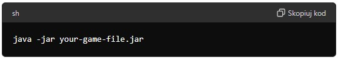

# Chess Game

A chess game built using the libGDX engine.

## Table of Contents
- [Features](#features)
- [Installation](#installation)
- [Running the Game](#running-the-game)

## Features
- Rich grahics and animations powered by libGDX
- Classic chess gameplay
- Single-player mode
- Implementation of basic chess moves, such as moving pawns, knights, rooks, bishops, queens, and kings.
- Ability to perform castling.
- Detection of check.
- Detection and signaling of checkmate.
- Mechanism for recognizing stalemate situations.
- Handling of pawn promotion, including the possibility of promoting to a queen, rook, bishop, or knight.

## Installation
### Perequisites
- Java Development Kit (JDK) 17 or higher

You can download the JDK from [Oracle's website](https://www.oracle.com/pl/java/technologies/downloads/) or use your system's package manager.
### Download
You can download the latest release from the [Release page](https://github.com/palaszwaldemar/Chess-gdx/releases).

## Running the Game
1. Ensure you have Java installed and set up correctly. You can check this by runnig the following command in your terminal or command prompt:

   
2. Download the '.jar' file from [Releases page](https://github.com/palaszwaldemar/Chess-gdx/releases).
3. Open a terminal or command prompt and navigate to the directory where the '.jar' file is located.
4. Run the following command to start the game:

   
5. Replace your-game-fie.jar' with the actual name of the downloaded file.
