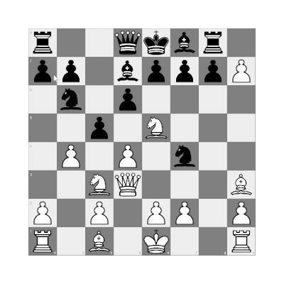
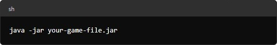

# Chess Game

A chess game built using the libGDX engine.

## Table of Contents
- [Gameplay](#gameplay)
- [Features](#features)
- [Installation](#installation)
- [Running the Game](#running-the-game)
- [Tests](#tests)
- [Documentation](#documentation)
- [Future Development](#future-development)
- [Contributing](#contributing)

## Gameplay
Below is a short GIF showing the basic moves in the chess game:

### Presented moves: 
- moving chess pieces
- capturing chess pieces
- promoting pawns
- castling

## Features
- Rich graphics and animations powered by libGDX
- Classic chess gameplay
- Single-player mode
- Implementation of basic chess moves, such as moving pawns, knights, rooks, bishops, queens, and kings
- Ability to perform castling
- Detection of check
- Detection and signaling of checkmate
- Mechanism for recognizing stalemate situations
- Handling of pawn promotion, including the possibility of promoting to a queen, rook, bishop, or knight

## Installation
### Prerequisites
- Java Development Kit (JDK) 17 or higher

You can download the JDK from [Oracle's website](https://www.oracle.com/pl/java/technologies/downloads/) or use your system's package manager.
### Download
You can download the latest release from the [Release page](https://github.com/palaszwaldemar/Chess-gdx/releases).

## Running the Game
1. Ensure you have Java installed and set up correctly. You can check this by running the following command in your terminal or command prompt:

   
2. Download the '.jar' file from [Releases page](https://github.com/palaszwaldemar/Chess-gdx/releases)
3. **You can simply double-click the '.jar' file to start the game**. If double-clicking doesn't work, open a terminal or command prompt and navigate to the directory where the '.jar' file is located
4. Run the following command to start the game:

   
5. Replace 'your-game-fie.jar' with the actual name of the downloaded file

## Tests
This project includes unit tests to ensure the correctness of the core functionality. You can run the tests using your preferred Java IDE or via the command line using a build tool like Maven. To run the tests via command line, navigate to the project directory and use the following commands:

## Documentation
Documentation for the most important classes is provided to help understand the code structure and functionality. You can generate the documentation using the following command:

## Future Development
The project is actively being developed, and future versions may include additional features, enhancements and bug fixes. Planned features for the future include:
- Implementing en passant capture
- Adding a main menu
- Adding multiplayer mode
- Implementing artificial intelligence for single-player mode
- Improving user interface and player experience
- Optimizing performance and increasing game stability
If you have an idea for a new feature or improvement, or you'd like to contribute to the project in any other way, I encourage you to submit proposals and participate in its development.

## Contributing
1. Fork the repository
2. Create your feature branch (**git checkout -b feature/Feature**)
3. Commit your changes (**git commit -m 'Add some Feature'**)
4. Push to the branch (**git push origin feature/Feature**)
5. Open a Pull Request
